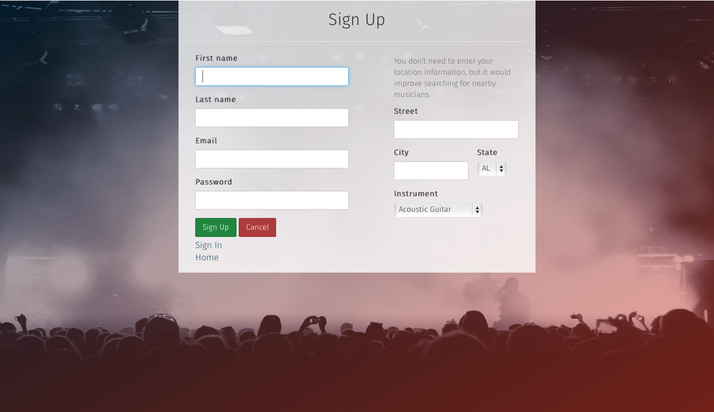
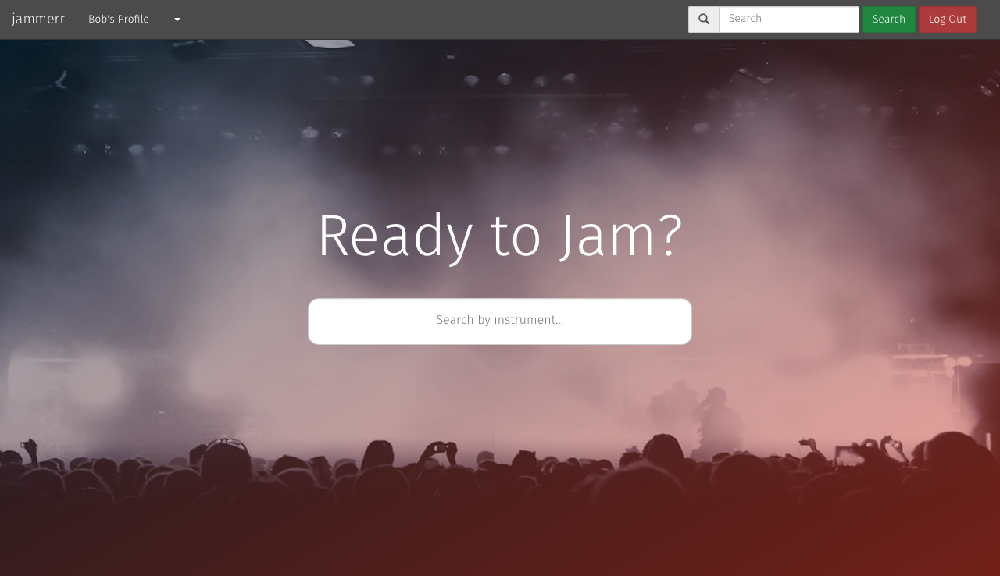
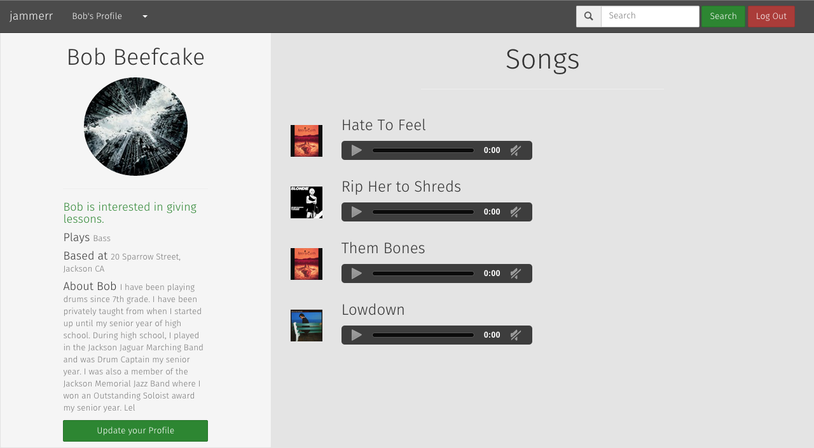
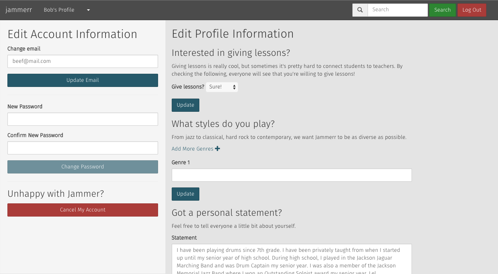

This is the main page of Jammer.

This is the sign up part of the main page.

This is the main search page of Jammer.

This is the user profile.

This is the edit part of the user profile.

to install imagemagick

brew install imagemagick -- with homebrew

for getting to the aws console

https://console.aws.amazon.com/iam/home

if nokogiri doesn't install, use

<strong>xcode-select --install</strong>

<h2>USING REDIS:</h2>

installing most recent version of redis

go to: http://redis.io/download

	<strong>- get v 2.8.13</strong>

unzip the file

<ul>follow these terminal commands:
<li>cd redis-2.8.13</li>
<li>make</li>
<li>cp src/redis-server src/redis-cli /usr/bin</li>
</ul>

then you should be good to go!

<h2>to start redis:</h2>

redis-server

<h2>To start Faye:</h2>

rackup faye.ru -E production -s thin

<h2>Give new collaborators the application.yml and secrets.yml file</h2>
